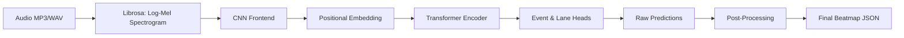

# Penjelasan Arsitektur & Alur Data Model BeatBERT (Skripsi)

Dokumen ini disusun untuk memberikan konteks teknis yang mendalam mengenai sistem **BeatBERT** (pembangkit beatmap berbasis kecerdasan buatan) untuk digunakan sebagai referensi bagi ChatGPT atau bahan penulisan skripsi.

---

## 1. Arsitektur Umum & Pipeline Data
Model skripsi ini menggunakan kombinasi **CNN (Convolutional Neural Network)** sebagai pengekstraksi fitur lokal dan **Transformer Encoder (BERT-like)** sebagai pemodel konteks temporal global untuk memprediksi letak nada (*beat*) beserta jalurnya (*lane*).

Secara garis besar, pipeline pemrosesan audio adalah sebagai berikut:


---

## 2. Pemrosesan Awal Audio (Librosa)
Audio berformat `.mp3` atau `.wav` dibaca menggunakan Librosa dengan konfigurasi berikut (sesuai `local.yaml`):
- **Sample Rate ($sr$)**: 22050 Hz (mono)
- **n_fft**: 2048
- **hop_length**: 256 samples (setiap frame waktu $t$ berdurasi $\approx 11.6$ ms)
- **n_mels**: 128 (dimensi frekuensi)

Hasil akhirnya adalah **Log-Mel Spectrogram** dengan bentuk tensor:
$$\text{Shape: } [Batch, 128, T]$$
Di mana $128$ adalah jumlah pita frekuensi Mel, dan $T$ adalah jumlah total frame waktu.

---

## 3. Ekstraksi Fitur Lokal (CNN Frontend)
Fungsi utama CNN Frontend (`CNNFrontend`) adalah mengekstrak fitur lokal spektral dengan mereduksi sumbu frekuensi (dari 128 menjadi 32), namun **tetap mempertahankan resolusi waktu ($T$)** secara penuh menggunakan pooling selektif pada sumbu frekuensi saja (`MaxPool2d(kernel_size=(2, 1))`).

### Tahapan Transformasi Tensor CNN:
1. **Input Mel Spectrogram**: `[Batch, 1, 128, T]` (dimensi channel disisipkan).
2. **Layer CNN & Pooling**:
   - `Conv2d(1 -> 32) -> BatchNorm2d -> GELU` $\to [Batch, 32, 128, T]$
   - `Conv2d(32 -> 64) -> BatchNorm2d -> GELU` $\to [Batch, 64, 128, T]$
   - `MaxPool2d(kernel_size=(2, 1))` $\to [Batch, 64, 64, T]$ (reduksi frekuensi $128 \to 64$)
   - `Conv2d(64 -> 128) -> BatchNorm2d -> GELU` $\to [Batch, 128, 64, T]$
   - `MaxPool2d(kernel_size=(2, 1))` $\to [Batch, 128, 32, T]$ (reduksi frekuensi $64 \to 32$)
3. **Rearrange & Flatten**:
   - Dimensi diubah ke `[Batch, T, 128, 32]` (menempatkan sumbu waktu $T$ di depan).
   - Diratakan (*flatten*) menjadi `[Batch, T, 4096]` (gabungan $128 \times 32$).
4. **Proyeksi Linear (`d_model`)**:
   - Diproyeksikan menggunakan linear layer (`Linear(4096 -> 128)`) menghasilkan representasi terkompresi berdimensi `d_model = 128`.
   - **Output Akhir CNN**: `[Batch, T, 128]`.

### Contoh Nilai Vektor Output CNN (Frame Pertama, $t=0$):
*Vektor representasi suara berdimensi 128 sebelum masuk ke Transformer Encoder:*
```python
Shape: [1, 128] # Untuk 1 frame waktu
Values: [-12.5086622, 0.0867441, 17.6855106, 4.8124413, -11.2852497, ...]
```

---

## 4. Pemodelan Temporal Global (Transformer Encoder)
Output dari CNN Frontend ditambahkan dengan **Positional Embedding** untuk memberi tahu posisi urutan waktu kepada model, lalu dimasukkan ke dalam **Transformer Encoder** (2 layer, 4 heads). Di sini terjadi mekanisme *Self-Attention* yang menghubungkan fitur audio satu dengan lainnya secara temporal.

### Output Transformer Encoder:
Outputnya memiliki dimensi yang sama dengan inputnya, yaitu `[Batch, T, 128]`, tetapi setiap elemen vektor di dalamnya kini sudah mengandung informasi kontekstual temporal global (apa yang terjadi sebelum dan sesudah frame tersebut).

### Contoh Nilai Vektor Output Transformer (Frame Pertama, $t=0$):
*Vektor yang sudah kaya akan informasi konteks waktu global setelah proses Self-Attention:*
```python
Shape: [1, 128] # Untuk 1 frame waktu
Values: [-0.3260714, 0.1320861, 1.1267024, 0.5797080, -0.5532782, ...]
```

---

## 5. Output Model Sebelum Post-Processing (Raw Predictions)
Dari output Transformer Encoder, model memiliki dua kepala klasifikasi (*classification heads*) berupa layer linear:
1. **Event Head (`Linear(128 -> 1)`)**: Memprediksi apakah ada ketukan nada (*event/beat*) di frame tersebut. Nilai logit dilewatkan ke fungsi **Sigmoid** untuk mendapatkan nilai probabilitas $[0, 1]$.
2. **Lane Head (`Linear(128 -> 4)`)**: Memprediksi di kolom mana nada tersebut berada (4 pilihan kolom). Nilai logits dilewatkan ke fungsi **Softmax** untuk mendapatkan distribusi probabilitas yang jika dijumlah bernilai $1.0$.

### Contoh Sampel Output Riil (Berdasarkan Checkpoint Model Aktif):
Berikut adalah contoh keluaran mentah model untuk **5 frame berturut-turut** ($\approx 58$ ms pertama audio):

#### A. Probabilitas Event / Nada (Hasil Aktivasi Sigmoid)
Menunjukkan tingkat keyakinan model bahwa terdapat nada pada frame tersebut.
- **Shape**: `[T]` (misal: `[5]`)
- **Nilai Probabilitas**:
  ```python
  Frame 0 (t = 0.0 ms):  0.1485 (14.8%)
  Frame 1 (t = 11.6 ms): 0.4386 (43.9%)
  Frame 2 (t = 23.2 ms): 0.3469 (34.7%)
  Frame 3 (t = 34.8 ms): 0.1747 (17.5%)
  Frame 4 (t = 46.4 ms): 0.3199 (32.0%)
  ```

#### B. Probabilitas Lane / Jalur Nada (Hasil Aktivasi Softmax)
Menunjukkan probabilitas nada diletakkan pada salah satu dari 4 jalur (`Lane 0`, `Lane 1`, `Lane 2`, `Lane 3`).
- **Shape**: `[T, 4]` (misal: `[5, 4]`)
- **Nilai Distribusi Probabilitas**:
  ```python
  Frame 0: [0.0768, 0.3787, 0.3839, 0.1607]  --> Lane dominan: Lane 2 (38.4%)
  Frame 1: [0.1385, 0.4511, 0.3461, 0.0642]  --> Lane dominan: Lane 1 (45.1%)
  Frame 2: [0.1228, 0.5808, 0.2166, 0.0799]  --> Lane dominan: Lane 1 (58.1%)
  Frame 3: [0.1328, 0.6251, 0.1193, 0.1228]  --> Lane dominan: Lane 1 (62.5%)
  Frame 4: [0.0680, 0.6777, 0.1834, 0.0709]  --> Lane dominan: Lane 1 (67.8%)
  ```

---

## 6. Mengapa Dibutuhkan Post-Processing?
Jika kita langsung mengambil prediksi mentah di atas, beatmap yang dihasilkan akan berantakan, bertumpuk, atau tidak sinkron dengan musik. 
Oleh karena itu, tahap **Post-Processing** melakukan penyaringan dan perapihan sebagai berikut:

1. **Threshold Filtering**: Hanya meloloskan frame dengan probabilitas event di atas batas tertentu (contoh konfigurasi Easy Mode di skripsi Anda: `event_threshold = 0.60`). Pada contoh di atas, tidak ada satu pun frame dari 5 frame pertama yang lolos karena probabilitas tertinggi hanya `0.4386` (Frame 1).
2. **Min Gap Constraint**: Menghindari dua nada berhimpitan terlalu dekat (misal minimum berjarak `200 ms` untuk nada umum, atau `250 ms` untuk nada di kolom/lane yang sama) agar permainan tetap *playable*.
3. **Onset & Beat Snapping**: Menyelaraskan (mensejajarkan) waktu prediksi model dengan ketukan alami lagu (*onset* / *beat* tempo asli) yang dihitung dari algoritma deterministik Librosa, dengan toleransi tertentu (misal toleransi snap beat `40 ms`).
4. **Density Control**: Membatasi kerapatan nada maksimum per detik (contoh Easy Mode: maks 3 notes per detik) agar tingkat kesulitan beatmap tetap konsisten.

Hasil pasca post-processing inilah yang kemudian diubah menjadi format koordinat waktu dan lane yang siap dibaca oleh game engine Unity dalam bentuk file JSON.
